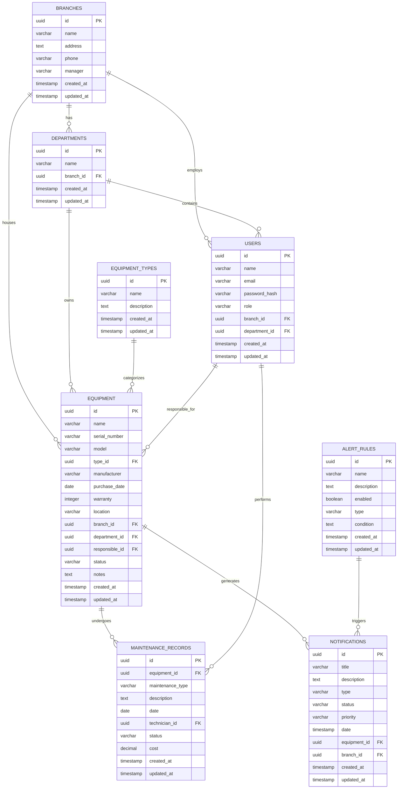

# Entity Relationship Diagram (ERD)

```mermaid
erDiagram
    BRANCHES ||--o{ DEPARTMENTS : has
    BRANCHES ||--o{ EQUIPMENT : houses
    BRANCHES ||--o{ USERS : employs
    DEPARTMENTS ||--o{ USERS : contains
    DEPARTMENTS ||--o{ EQUIPMENT : owns
    EQUIPMENT_TYPES ||--o{ EQUIPMENT : categorizes
    EQUIPMENT ||--o{ MAINTENANCE_RECORDS : undergoes
    EQUIPMENT ||--o{ NOTIFICATIONS : generates
    USERS ||--o{ EQUIPMENT : responsible_for
    USERS ||--o{ MAINTENANCE_RECORDS : performs
    ALERT_RULES ||--o{ NOTIFICATIONS : triggers

    BRANCHES {
        uuid id PK
        varchar name
        text address
        varchar phone
        varchar manager
        timestamp created_at
        timestamp updated_at
    }

    DEPARTMENTS {
        uuid id PK
        varchar name
        uuid branch_id FK
        timestamp created_at
        timestamp updated_at
    }

    USERS {
        uuid id PK
        varchar name
        varchar email
        varchar password_hash
        varchar role
        uuid branch_id FK
        uuid department_id FK
        timestamp created_at
        timestamp updated_at
    }

    EQUIPMENT_TYPES {
        uuid id PK
        varchar name
        text description
        timestamp created_at
        timestamp updated_at
    }

    EQUIPMENT {
        uuid id PK
        varchar name
        varchar serial_number
        varchar model
        uuid type_id FK
        varchar manufacturer
        date purchase_date
        integer warranty
        varchar location
        uuid branch_id FK
        uuid department_id FK
        uuid responsible_id FK
        varchar status
        text notes
        timestamp created_at
        timestamp updated_at
    }

    MAINTENANCE_RECORDS {
        uuid id PK
        uuid equipment_id FK
        varchar maintenance_type
        text description
        date date
        uuid technician_id FK
        varchar status
        decimal cost
        timestamp created_at
        timestamp updated_at
    }

    NOTIFICATIONS {
        uuid id PK
        varchar title
        text description
        varchar type
        varchar status
        varchar priority
        timestamp date
        uuid equipment_id FK
        uuid branch_id FK
        timestamp created_at
        timestamp updated_at
    }

    ALERT_RULES {
        uuid id PK
        varchar name
        text description
        boolean enabled
        varchar type
        text condition
        timestamp created_at
        timestamp updated_at
    }
```
